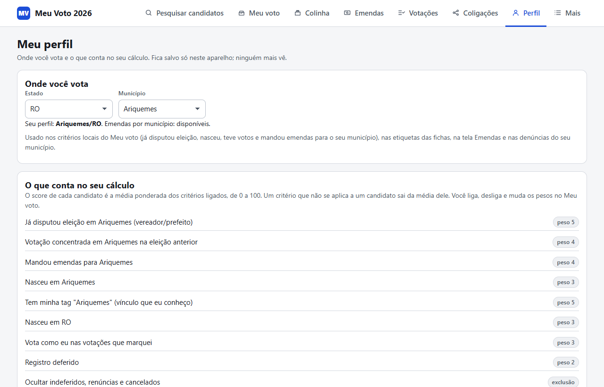
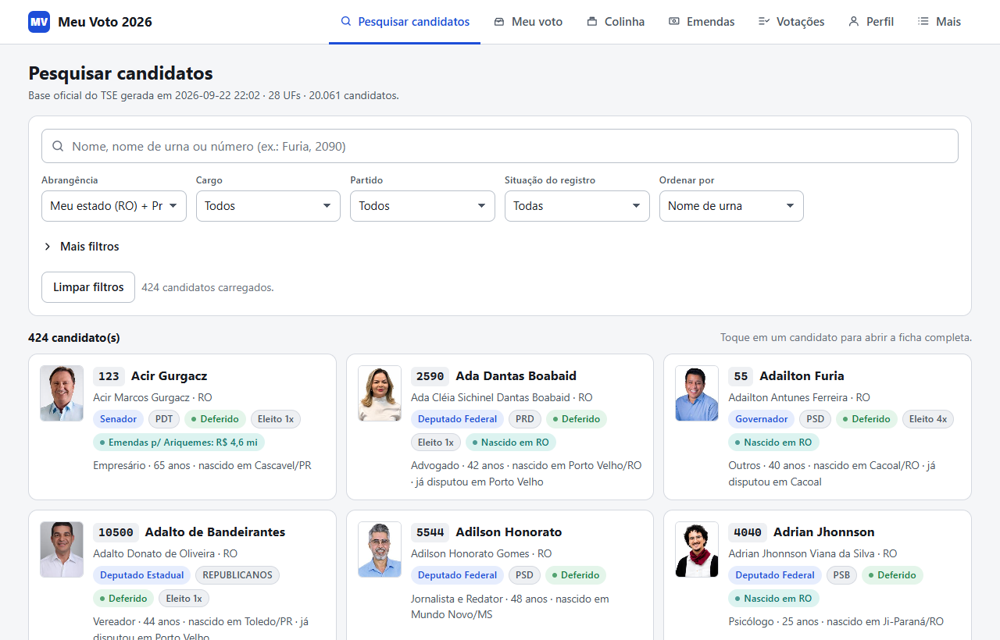
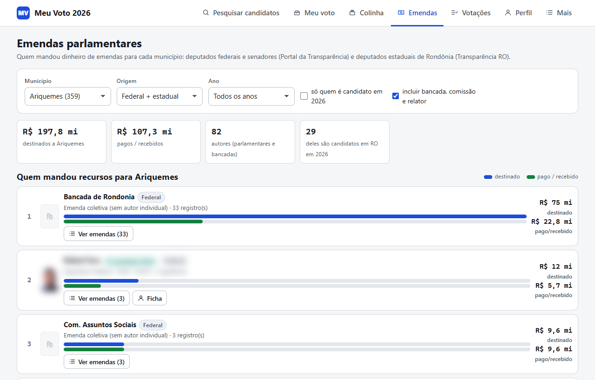
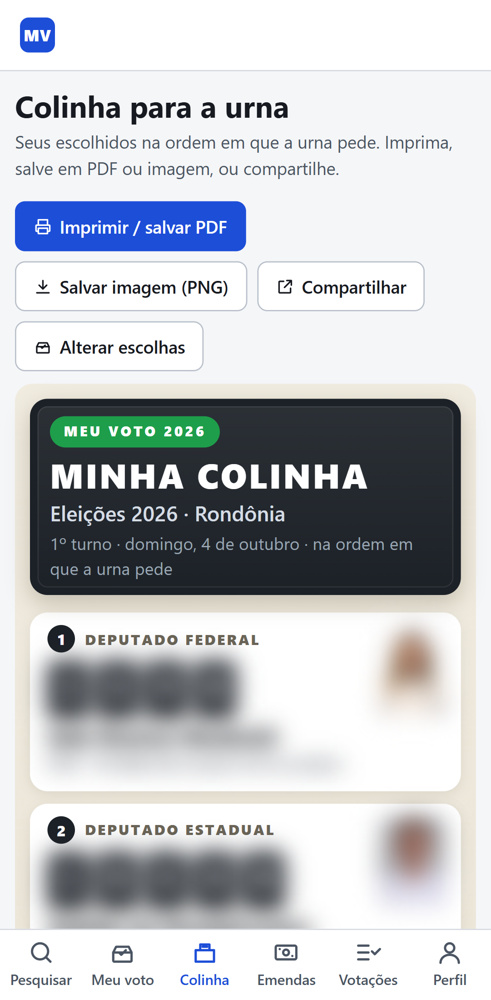
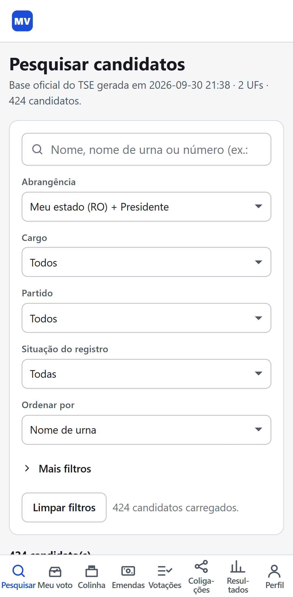
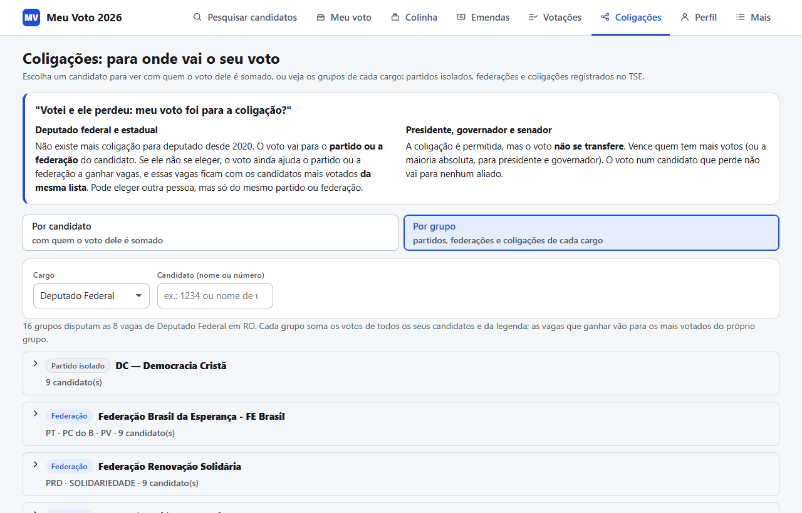
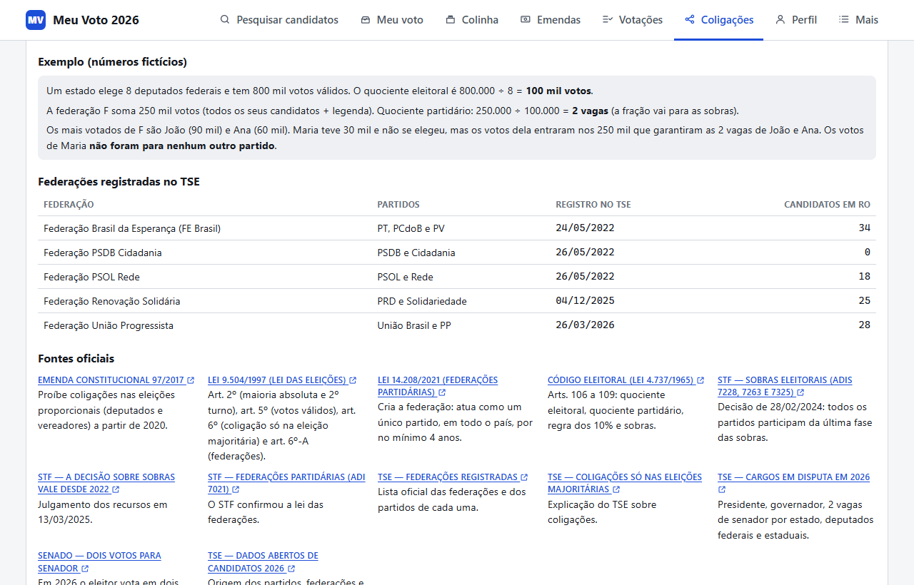

# Meu Voto 2026 — mini-sistema local para escolher candidatos

Ferramenta gratuita e 100% local para ajudar o eleitor a escolher seus candidatos nas eleições gerais de 2026
(Presidente, Governador, Senador, Deputado Federal e Deputado Estadual), com foco em **quem representa de fato a
sua região**.

## Por que este projeto existe

Na prática, boa parte dos recursos que chegam a um município brasileiro — obras, equipamentos de saúde, verbas
para escolas, estradas e custeio — passa pelas mãos de deputados e senadores, principalmente por meio das
**emendas parlamentares**. Por isso, para muitos eleitores uma pergunta decisiva é: *quem, entre os candidatos,
tem vínculo real com a minha cidade e com o meu estado, e quem já trouxe recursos para cá?*

Responder a isso hoje exige garimpar vários portais oficiais diferentes (TSE, Câmara, Senado, Assembleia
Legislativa, Portal da Transparência), cada um com seu formato. O **Meu Voto 2026** reúne essas informações
públicas em um só lugar e permite que cada eleitor:

- descubra quais candidatos têm ligação com o seu município (já disputaram eleição lá, tiveram votos
  concentrados lá, nasceram lá, mandaram emendas para lá);
- veja **quanto dinheiro de emendas cada parlamentar destinou e efetivamente pagou** para a sua cidade;
- compare candidatos com critérios e pesos escolhidos por ele mesmo, e não por terceiros;
- confira como os parlamentares votaram, com link para a fonte oficial;
- monte e imprima a sua "colinha" para levar à urna.

O projeto nasceu para atender eleitores de **Ariquemes, Rondônia**, e hoje funciona para qualquer município do
país (aba **Perfil**). Algumas bases, como as emendas estaduais e as votações da Assembleia, cobrem por enquanto
apenas Rondônia.

## Principais funcionalidades

- **Pesquisa** dos 20.063 candidatos de 2026 do Brasil, com filtros por UF, cargo, partido, situação,
  município onde já disputou eleição, idade, escolaridade, ocupação e outros.
- **Ficha completa do candidato**: foto oficial, situação do registro, vice/suplentes, histórico eleitoral,
  votação por município na eleição anterior, bens declarados, certidões criminais e plano de governo (PDF),
  emendas parlamentares, financiamento de campanha 2026, atuação na Câmara e votações.
- **Meu voto**: ranking por cargo com critérios e pesos ajustáveis e a explicação da nota de cada candidato.
- **Colinha** no padrão do e-Título, para imprimir (A4), salvar como imagem PNG (2160×3840, visual de urna, para o status ou o papel de parede) ou compartilhar pelo celular.
- **Emendas**: quem mandou dinheiro para cada município de RO, destinado × pago, item a item.
- **Votações**: ALE-RO, Câmara dos Deputados e Senado, voto a voto, com filtros.
- **Coligações**: para onde vai o voto em cada candidato. Para deputado, o voto é somado ao partido ou à
  federação, e a tela lista os outros candidatos que esse voto pode ajudar a eleger. Para presidente, governador
  e senador, mostra a coligação e explica que o voto não se transfere. Inclui as regras (quociente eleitoral,
  sobras, federações) com links para a lei, o STF e o TSE.
- **Versão para celular** em um único arquivo HTML, que funciona sem internet.
- **Testes automáticos** dos dados e da interface, incluindo auditoria cruzada com as APIs oficiais.

## Princípios

- **Neutralidade**: o sistema não indica em quem votar nem classifica votos como bons ou ruins. Nas votações,
  mostra apenas "na votação X, o parlamentar Y votou Z", com link para a fonte oficial; Sim e Não têm cores
  neutras. Quem define o que importa é o eleitor, no Perfil e nos critérios.
- **Somente dados públicos oficiais**, sempre com a origem indicada. Onde a fonte não registra algo (por exemplo,
  voto individual em votação simbólica), o sistema diz que não há registro em vez de supor.
- **Cuidado com homônimos**: pais e filhos, irmãos e pessoas com o mesmo nome de urna são comuns na política.
  Os cruzamentos entre bases são confirmados por data de nascimento e histórico eleitoral, e os casos difíceis
  viraram testes automáticos.
- **Privacidade**: tudo roda no computador ou celular do usuário, sem servidor e sem cadastro. Favoritos, notas e
  escolhas ficam só no navegador.

## Tecnologias

- **Interface**: HTML, CSS e JavaScript puros, sem frameworks nem bibliotecas externas; abre por duplo clique
  (`file://`), sem servidor.
- **Coleta e processamento**: Python 3 (biblioteca padrão), mais `curl_cffi` (download do TSE) e `playwright`
  (alternativa de download e testes de interface no Microsoft Edge).
- **OCR** das atas escaneadas da ALE-RO: OCR nativo do Windows, chamado via PowerShell (`scripts/ocr_windows.ps1`).

## Telas

| | |
|---|---|
|  |  |
| **Perfil** — o eleitor escolhe onde vota; os critérios locais passam a usar esse município. | **Pesquisa** — todos os candidatos, com filtros e ficha completa. |
|  |  |
| **Emendas** — quem destinou e quem efetivamente pagou recursos ao município. | **Votações** — o voto de cada parlamentar, com link para a fonte oficial. |
|  |  |
| **Colinha** — números na ordem da urna, para imprimir ou compartilhar. | **Celular** — arquivo único que funciona sem internet. |
|  |  |
| **Coligações** — para onde vai o voto: partido, federação ou coligação de cada candidato. | **Coligações** — as regras explicadas, as federações registradas no TSE e as fontes oficiais. |

Imagens geradas com os dados oficiais de setembro de 2026 e o Perfil em Ariquemes/RO. Na Emendas e na
Colinha, nomes, fotos e números de candidatos foram borrados de propósito: as capturas ilustram o
funcionamento do sistema e não indicam voto em ninguém.

## Início rápido

Os dados já processados (`data/*.js`, fotos dos candidatos de RO e a presidente) estão no repositório, com a base
de 28/09/2026. Para só usar, basta clonar e abrir `meu-voto.html#perfil` no navegador, por duplo clique.

Para atualizar os dados ou gerar tudo do zero (requisitos: Python 3 e Windows com Microsoft Edge, usado pelo
baixador automático e pelos testes de interface):

```
python -m pip install curl_cffi playwright
python scripts\baixar_tse.py          # baixa os dados do TSE para raw/
python scripts\build_data.py          # gera data/ (candidatos, fotos, PDFs)
python scripts\build_municipios.py    # lista de municípios do Perfil
python scripts\atualizar_tudo.py      # ou: tudo de uma vez (TSE, emendas, celular e testes)
```

As integrações opcionais (Câmara, emendas, votações, versão celular) estão descritas abaixo. Não fazem parte do
repositório, por tamanho, e são recriados pelos scripts: os dados brutos (`raw/`, cerca de 1,6 GB), os PDFs de
certidões e planos de governo (`data/certidoes/`, `data/propostas/`, cerca de 340 MB) e a versão celular
(`mobile/`). Sem os PDFs, a ficha continua funcionando e mantém o link para os mesmos documentos no
DivulgaCandContas.

## Páginas

| Arquivo | O que faz |
|---|---|
| `mobile/meu-voto-mobile.html` | **Versão celular, offline**: um único arquivo com tudo que o desktop tem (pesquisa, ficha completa, critérios, ranking, colinha para imprimir, salvar em PNG ou compartilhar, denúncias, fontes, dados da Câmara, emendas). RO + presidente com fotos: cerca de 14 MB. `mobile/meu-voto-mobile-brasil.html`: idem com as 27 UFs (cerca de 74 MB, carregadas sob demanda). Gerados por `scripts/build_mobile.py`. |
| `index.html` | **Pesquisa geral**: todos os 20.063 candidatos do Brasil, com busca por nome/número e filtros (UF, cargo, partido, situação, reeleição, gênero, município/UF de nascimento, **município onde já disputou eleição**, já foi eleito, motivo de indeferimento, idade, escolaridade, ocupação, meus marcadores). Clique no candidato para ver a ficha completa. |
| `meu-voto.html` | Quatro telas, as mesmas do celular (**Meu voto · Colinha · Perfil · Mais**; o menu do topo leva também às outras páginas). **Meu voto**: abas por cargo (com o nº de vagas real), painel de critérios com pesos, ranking com score e explicação, botão "Escolher". **Colinha**: cartão no padrão da "colinha" do e-Título — ordem da urna, dígitos em caixas, foto, nome, partido, vice/suplentes; toque em um item para abrir a ficha; botões **Imprimir / salvar PDF** (A4, sem cabeçalho do navegador) e **Compartilhar** (menu de compartilhamento do celular ou área de transferência). **Mais**: denúncias Pardal e fontes externas. Em janelas estreitas o menu vai para a barra inferior, como no celular. |
| `emendas.html` | **Emendas parlamentares**: escolha um município de RO (abre no município do seu Perfil) e veja **quem mandou dinheiro de emendas para lá** — ranking por parlamentar (destinado × pago/recebido), destaque para quem é candidato em 2026, e a lista item a item com ano, área, objeto e quem recebeu. Filtros: federal/estadual, ano, só candidatos, com/sem emendas coletivas (bancada, comissão, relator). Gerado por `scripts/fetch_emendas.py`. |
| `votacoes.html` | **Votações**: como votaram os parlamentares de RO. Quatro modos: ALE-RO votações nominais (voto de cada deputado estadual), ALE-RO leis sem voto individual (votação simbólica, desde 2023, com autoria e declarações oficiais), Câmara dos Deputados e Senado Federal (candidatos de RO que são ou foram deputados federais/senadores). Filtros por parlamentar, tipo, ano e texto. Só mostra o que as fontes oficiais registram, sem classificar votos como bons ou ruins. Gerado por `scripts/fetch_alero.py` e `scripts/fetch_votacoes_federais.py`. |
| `coligacoes.html` | **Coligações**: para onde vai o voto. **Por candidato**: escolha um candidato (ou use "Para onde vai o voto" na ficha). Para deputado, mostra o partido ou a federação e os outros candidatos do mesmo grupo, que somam votos entre si. Para presidente, governador e senador, mostra a coligação, a chapa e os candidatos apoiados pelos mesmos partidos, e avisa que o voto não se transfere. **Por grupo**: partidos isolados, federações e coligações de cada cargo, com os candidatos. Explicação das regras com fontes oficiais (Constituição, leis, STF, TSE). Usa os campos de agremiação do `consulta_cand` do TSE. |

**Ficha do candidato** (modal): foto oficial, **atuação na Câmara dos Deputados** (para quem já é deputado: proposições, frentes, comissões e links "Como votou", "Projetos", "Gastos" — via `scripts/fetch_camara.py`), situação do julgamento, chapa (vice/suplentes com foto e certidões), dados pessoais,
**votação por município na eleição anterior** (quando o arquivo de votação está em `raw/`),
**histórico eleitoral** (todas as eleições anteriores com cargo, município e resultado), **bens declarados**
(total + lista), **motivos de indeferimento/cassação**, links para o **plano de governo (PDF)** e para as
**certidões criminais (PDF)**, redes sociais, link para o DivulgaCandContas, e seus marcadores pessoais
(favorito, tags, nota), e **emendas parlamentares** (para quem já teve mandato: total empenhado e pago,
**onde o dinheiro chegou** por município, destino declarado no orçamento, principais áreas e quanto foi para
o seu município — a tag "Emendas p/ (município)" aparece também no cartão) e **financiamento de campanha 2026**
(arrecadado, gastos contratados e pagos, % do limite legal, quanto é dinheiro público — fundo eleitoral e
partidário —, maiores doadores, com o que gastou e maiores fornecedores).

Tudo que você marca (favoritos, notas, tags, critérios, escolhas) fica salvo no navegador
(`localStorage`). Use **Exportar / Importar** na página "Meu voto" para fazer backup ou levar para outro PC.

## 1. Dados oficiais do TSE

Fonte: <https://dadosabertos.tse.jus.br/dataset/candidatos-2026>. O CDN do TSE bloqueia curl/urllib pela
"impressão digital" TLS, então use o baixador automático, que imita o Chrome (curl_cffi) e, se ainda for
barrado, abre o Microsoft Edge instalado (Playwright) e baixa como um navegador comum:

```
python -m pip install curl_cffi playwright     # uma vez (não precisa de "playwright install": usa o Edge)
python scripts\baixar_tse.py --listar          # mostra o que baixaria, com tamanhos
python scripts\baixar_tse.py                   # perfil "essencial" (o que o sistema usa), UFs RO e BR
python scripts\baixar_tse.py --perfil tudo     # tudo: candidatos, prestação de contas, resultados 2022/2024,
                                               # eleitorado, pesquisas registradas, processos, denúncias...
python scripts\baixar_tse.py --ufs RO,MT,BR    # arquivos por UF (fotos, certidões...) de outras UFs
python scripts\baixar_tse.py --so consulta_cand --rebuild   # só alguns arquivos e já roda o build
```

A lista vem da API do portal (sempre atualizada); é incremental (`raw/_downloads.json` guarda ETag e
tamanho, o que não mudou é pulado) e retoma downloads interrompidos. Também dá para baixar à mão no
navegador. Os ZIPs ficam na pasta **`raw/`** sem extrair:

| ZIP | O que alimenta |
|---|---|
| `consulta_cand_2026.zip` | **obrigatório** — cadastro dos candidatos |
| `consulta_cand_complementar_2026.zip` | situação do julgamento (deferido/indeferido/pendente…), município de nascimento, idade, apto na urna, limite de gastos |
| `historico_candidatura_2026.zip` | eleições anteriores de cada candidato → histórico, "já foi eleito Nx", "tenta reeleição", municípios onde disputou |
| `bem_candidato_2026.zip` | bens declarados |
| `rede_social_candidato_2026.zip` | redes sociais |
| `motivo_cassacao_2026.zip` | motivos de indeferimento/cassação |
| `consulta_vagas_2026.zip` | vagas por cargo/UF |
| `foto_cand2026_RO_div.zip`, `foto_cand2026_BR_div.zip` | fotos oficiais → `data/fotos/` (cada foto também vira `<sq>.js`, para entrar na colinha em PNG aberta via `file://`) |
| `proposta_governo_2026_RO.zip`, `_BR.zip` | planos de governo (PDF) → `data/propostas/` |
| `certidao_criminal_2026_RO.zip`, `_BR.zip` | certidões criminais (PDF, ~290 MB) → `data/certidoes/` — titulares **e** vices/suplentes |
| `votacao_candidato_munzona_2022.zip` (ou `_2022_RO.zip`) e `_2024.zip` | **votos por município nas eleições anteriores** → % de votos no seu município de quem já concorreu (critério "votação concentrada" e tabela por município na ficha). Dataset <https://dadosabertos.tse.jus.br/dataset/resultados-2022> → "Votação nominal por município e zona". O ZIP nacional de 2022 tem 16 GB descompactados; o script lê por UF com pré-filtro (~40 s). `--votacao-ufs RO` cruza só Rondônia. `votacao_secao_*` e `detalhe_votacao_*` são ignorados. |
| `prestacao_de_contas_eleitorais_candidatos_2026.zip` | **financiamento de campanha** (receitas e despesas declaradas ao TSE, parciais até a eleição) → seção na ficha e critérios opcionais "pouco dependente de dinheiro público" e "muitos doadores pessoas físicas". O município do doador não é publicado pelo TSE. |
| `denuncia_2020/2022/2024/2026.zip` | denúncias do app **Pardal** (propaganda irregular). São **anônimas** — o TSE não identifica o candidato, só UF, município, cargo, tipo e o nº do processo no PJe. Viram o painel "Denúncias eleitorais" na página Meu voto (totais por cargo/tipo/município e links dos processos originados no município do Perfil). |

Baixou fotos/propostas/certidões de outra UF? Basta colocar o ZIP em `raw/` e rodar o script de novo.

## 2. Gerar os arquivos do sistema

```
python scripts\build_data.py                 # tudo (5 s + extração dos PDFs)
python scripts\build_data.py --sem-arquivos  # só os CSVs, não extrai fotos/PDFs
python scripts\build_data.py --votacao-ufs RO # cruza votação só de RO (mais rápido)
```

Gera `data/cand_XX.js` (um por UF, `BR` = presidente) e `data/manifest.js`. Rode de novo sempre que o TSE
atualizar a base (situações mudam até a eleição). Sem dependências além do Python 3.

### Dados de fora do TSE (opcional, precisa de internet)

```
python scripts/fetch_camara.py            # Câmara dos Deputados: deputados de RO (~40 s)
python scripts/fetch_camara.py --todas    # todos os 513 deputados (~20 min)
```

Casa os candidatos de 2026 que são ou já foram deputados federais desde 2015 (qualquer cargo disputado) com a
API pública de Dados Abertos da Câmara — **pela data de nascimento** (nome sozinho confundia os irmãos Mariana
e Maurício Carvalho) — e grava `data/camara.js`: proposições de autoria/coautoria desde 2023, frentes
parlamentares, comissões atuais e links diretos para as páginas de votações, projetos e gastos do deputado.
(A API deixou de devolver a cota parlamentar; por isso os gastos ficam só como link.)

### Emendas parlamentares (opcional, precisa de internet)

```
python scripts/fetch_emendas.py              # baixa as duas fontes e gera data/emendas.js (~1 min)
python scripts/fetch_emendas.py --sem-baixar # reprocessa os arquivos já baixados em raw/
```

- **Federal** (deputados federais e senadores, 2014 em diante): base oficial do Portal da Transparência
  (CGU), `EmendasParlamentares.zip`, atualizada diariamente. Traz destino declarado (município), área, ação e
  valores empenhado/pago; **quem recebeu o dinheiro** (prefeitura, fundo municipal, entidade) e em qual
  município; e o objeto dos convênios.
- **Estadual RO** (deputados estaduais, 2023 em diante): exportação do Portal da Transparência do Governo
  de Rondônia, com objeto, localidade, beneficiário e valores. Quando a localidade vem como "Estado de
  Rondônia", o município é identificado pela descrição do objeto (marcado na tela).
- **Casamento autor → candidato de 2026**, em camadas (nome sozinho erra: há filhos, irmãos e homônimos com
  o mesmo nome de urna, como "Eleuses Paiva" pai × filho ou dois "Carlos Magno" em RO):
  1. nome de urna idêntico, ou nome parecido **e** histórico do TSE mostrando que já disputou o cargo;
  2. **federal: confirmado pela data de nascimento** (±1 dia) contra a lista oficial de todos os deputados da
     Câmara e dos senadores/suplentes do Senado desde 2011 (`raw/camara_deputados.csv`, `raw/senado_senadores.json`);
  3. homônimos empatados só casam se um único tiver o cargo no histórico; mesma pessoa com duas
     candidaturas (renunciou a uma) casa com a ativa.
  O log mostra os recusados e os ambíguos (`EMENDAS.rejeitados` / `EMENDAS.ambiguos`); corrija em
  `data/emendas_alias.json` (`"NOME NA FONTE": "SQ_CANDIDATO"` ou `null`) — os casos já conferidos estão lá,
  com nota. Estaduais de RO não têm lista oficial com nascimento: valem os passos 1 e 3.
- Emendas de bancada, comissão e relator (RP9) não têm autor individual: aparecem na tela por município, mas
  não contam para ninguém.
- "Empenhado" = reservado no orçamento; "pago" = saiu de fato. No federal, para o município de foco vale o
  maior entre o empenhado para lá e o que prefeitura/fundos/entidades de lá receberam.

### Votações da Assembleia Legislativa de RO (opcional, precisa de internet)

```
python scripts/fetch_alero.py                # API do SAPL da ALE-RO -> data/alero.js (~15 min)
```

- Fonte: API pública do SAPL (sapl.al.ro.leg.br/api), com os votos individuais registrados desde 2018.
- **Só votações nominais têm voto individual**: vetos, leis complementares e emendas à Constituição do Estado.
  Projeto de lei ordinária costuma ser votado de forma **simbólica** (o presidente declara o resultado), e aí
  não existe registro de quem votou como. Exemplo: PL 1243/2025 (Lei 6.328/2026), aprovado em 26/01/2026.
  Lista de presença não é lista de votação (a ALE-RO registrou isso na ata nº 252, de 09/02/2026).
- A ALE-RO lança os votos no SAPL com atraso; a tela mostra a data da última votação lançada.
- **Casamento deputado → candidato de 2026**: nome civil completo igual (ALE-RO × TSE); senão, nome de urna
  parecido + ao menos duas palavras do nome civil + histórico de Deputado Estadual em RO no TSE. Correções em
  `data/alero_alias.json` (`"<id do parlamentar no SAPL>": "<SQ do candidato>"` ou `null`).
- **Neutralidade**: o sistema mostra "na votação X, o deputado Y votou Z", com link para a matéria no SAPL.
  Sim e Não têm cores neutras (não verde/vermelho).
- **Vetos**: nos placares da ALE-RO, Sim = manter o veto do governador e Não = derrubar (confere em 710 de 712
  vetos; os 2 que não conferem aparecem marcados para conferir na fonte).
- **Leis sem voto individual** (`python scripts/fetch_alero.py --so-simbolicas`, ~5 min): todo projeto de lei, lei
  complementar e PEC aprovado ou rejeitado em plenário desde 01/02/2023, pela tramitação do SAPL (critério objetivo,
  sem escolher "votações importantes"), com autoria, lei gerada e se houve votação nominal. Posições individuais só
  entram por `data/alero_declaracoes.json`, com documento oficial e link (ex.: declaração do Delegado Lucas na ata
  nº 252 sobre o PL 1243/2025). A lista de presença não é usada.
- **Atas** (`python scripts/fetch_alero_atas.py`, ~15 min na primeira vez; depois só as atas novas): baixa as atas das
  sessões desde 2023 para `raw/alero_atas/`, extrai o texto (OCR nativo do Windows, `scripts/ocr_windows.ps1`, quando
  o PDF é escaneado) e lista em `logs/atas_posicoes.md` cada "se absteve / votou contra / voto contrário" achado,
  marcando o que já está cadastrado e o que é NOVO. Nada entra sozinho: cada posição nova é conferida na ata (inclusive
  os valores em R$ contra a ementa, porque o OCR às vezes embaralha as colunas) e só então vai para
  `data/alero_declaracoes.json`. Levantamento de 24/09/2026: 242 atas, 35 posições novas (36 no total).

### Votações na Câmara e no Senado (opcional, precisa de internet)

```
python scripts/fetch_votacoes_federais.py              # 2015-2026 -> data/votacoes_federais.js (~2 min)
python scripts/fetch_votacoes_federais.py --desde 2023 # só a legislatura atual
```

- **Câmara**: arquivos anuais de dados abertos (votações, votos e proposições), lidos direto da internet linha a
  linha; só os votos dos candidatos de RO ficam guardados. Deputado → candidato vem de `data/camara.js` (casado por
  data de nascimento).
- **Senado**: serviço `dadosabertos/votacao` (o ano inteiro, com os votos). Senador → candidato: data de nascimento
  (±1 dia) + nome civil quase igual, contra a lista oficial `raw/senado_senadores.json`.
- Votos com o **rótulo oficial** de cada Casa (Sim, Não, Abstenção, Obstrução, Artigo 17; no Senado também
  "Votou" em votação secreta, ausências e licenças por extenso). A tela mostra só os candidatos de RO e o placar
  da votação inteira.

### Versão para celular (offline)

```
python scripts/build_mobile.py               # mobile/meu-voto-mobile.html (RO + presidente, com fotos, ~14 MB)
python scripts/build_mobile.py --sem-fotos   # 1,1 MB
python scripts/build_mobile.py --uf MT       # outra UF
```

```
python scripts/build_mobile.py --todas       # meu-voto-mobile-brasil.html: todas as UFs (~74 MB)
```

Um arquivo só, sem dependências: funciona em qualquer navegador de celular sem internet. Navegação inferior
com sete telas (Pesquisar · Meu voto · Colinha · Emendas · Votações · Coligações · Perfil); Mais fica no Perfil. Os PDFs de certidões e planos (300 MB) não cabem
no arquivo: a ficha mostra um link para os mesmos documentos no DivulgaCandContas (abre com internet).
Favoritos/escolhas ficam salvos no navegador do celular; o Exportar/Importar usa o mesmo JSON do
computador. Rode de novo depois de cada `build_data.py` / `fetch_camara.py` / `fetch_emendas.py` / `fetch_alero.py` / `fetch_votacoes_federais.py` para atualizar.

### Atualizar tudo e conferir (use na semana da eleição)

```
python scripts\atualizar_tudo.py            # baixa o que mudou no TSE, regera dados, emendas e celular, e testa
python scripts\atualizar_tudo.py --rapido   # idem, testando só os dados (sem abrir o Edge)
```

### Testes

```
python scripts\testes\rodar_testes.py            # tudo (~4 min)
python scripts\testes\rodar_testes.py --so-dados # só os dados (~1 min)
python scripts\testes\rodar_testes.py --cruzado  # tudo + auditoria cruzada com as APIs oficiais (~5 min, internet)
```

- `teste_dados.py` — confere os arquivos gerados contra os brutos: candidatos x TSE, fotos/PDFs existentes,
  limite de gastos, receitas e despesas de cada candidato de RO centavo a centavo, totais de emendas x CGU,
  casamento autor → candidato (lista de homônimos/parentes que nunca podem casar), federações e coligações x TSE
  (nenhum deputado em coligação, só as 5 federações registradas), downloads íntegros e
  **avisos de dados velhos** (base, emendas e prestação de contas).
- `teste_ui.py` — abre o sistema no Edge (sem janela): pesquisa, todas as abas e critérios, **todas as fichas
  de RO e presidente**, tela Emendas em todos os municípios e filtros, tela Coligações (deputado federado,
  governador, senador e grupos de cada cargo), versão celular, funcionamento sem os
  dados opcionais, **impressão da colinha em PDF A4** (salvo em `scripts/testes/saida/colinha.pdf`) e
  **celulares emulados** (Pixel 7, iPhone 13, Galaxy S9+, iPhone SE: toque, fonte mínima, alvos de toque,
  sem rolagem lateral). Screenshots em `scripts/testes/saida/`.
- `teste_cruzado.py` — auditoria independente: sorteia votações, deputados e candidatos e confere os dados
  gerados contra as APIs oficiais (SAPL da ALE-RO, Câmara, Senado) e o TSE, e compara os cálculos feitos no
  navegador com os feitos em Python. Relatório em `scripts/testes/saida/auditoria_cruzada.md`.

Última rodada completa (24/09/2026): os três testes passaram; a auditoria cruzada teve 32 verificações OK,
nenhuma falha e 1 alerta que vem da própria fonte (placar de um veto de 2017 no SAPL).

## 3. Usar

- Abra `meu-voto.html#perfil` (aba **Perfil**) e escolha o estado e o município onde você vota.
- Abra `index.html`. Por padrão carrega o estado do Perfil + Presidente; troque a UF no filtro
  ("Todas as UFs" carrega o Brasil inteiro sob demanda).
- Na tela **Votações**, marque "Como você votaria?" nas votações que importam para você: o critério
  "Vota como eu" do Meu voto compara com o voto registrado de cada candidato que era parlamentar.
- Abra `meu-voto.html`, ajuste os critérios e vá marcando **favoritos**, **tags** e **escolhas**.
- Imprima a **Colinha** (Meu voto → Colinha → Imprimir) antes de ir votar: o celular não entra na cabine. A imagem PNG serve para revisar os números na fila.

## Critérios — como funcionam e como adicionar

Cada critério pontua o candidato de 0 a 1 e tem um peso de 0 a 5. O **score** é a média ponderada
dos critérios ativos (0–100). Critérios de **exclusão** removem o candidato do ranking. Um critério que
**não se aplica** a um candidato (`avaliar` devolve `null`: ex.: emendas para quem nunca teve mandato, votação
de 2022 para quem nunca disputou eleição estadual/federal, "vota como eu" para quem não votou nas votações
marcadas) **sai da média dele** — sem informação não é zero.

Critérios incluídos: já disputou eleição no meu município (histórico TSE) · votação concentrada no meu
município na eleição anterior · mandou emendas para o meu município (só RO por enquanto) · nasceu no meu
município · tem minha tag com o nome do município · nasceu no meu estado · **vota como eu nas votações que
marquei** · candidatura deferida · ocultar indeferidos/renúncias · sem motivo de
indeferimento · já foi eleito (ou nunca) · tem plano de governo · partidos preferidos · excluir partidos ·
está nos favoritos · tenta reeleição (ou renovação) · faixa etária · escolaridade mínima · gênero ·
ocupação contém · campanha pouco dependente de dinheiro público · muitos doadores pessoas físicas ·
excluir quem tem tag "evitar".

Para criar um critério novo, adicione um objeto ao array `CRITERIOS` em `assets/meu-voto.js`:

```js
{
  id: 'meuCriterio', label: 'Descrição que aparece no painel', tipo: 'texto', peso: 3, ativo: true,
  cfg: { termos: 'palavra1, palavra2' },              // configuração editável na tela
  avaliar: (c, cfg) => /* 0 a 1 */ (norm(c.ocupacao).includes('medic') ? 1 : 0),
}
```

Tipos: `bool` (sem config), `texto` (campo de texto — chave `termos` ou `tag`), `select` (uma opção —
`opcoes: () => [[valor, rótulo], ...]`), `faixa` (`cfg: {min, max}`), `lista` (chips multi-seleção —
`opcoes: (ctx) => [...]`), e `excluir: true` para virar exclusão. Os campos disponíveis em cada candidato
`c` estão listados no cabeçalho de `scripts/build_data.py` (ex.: `hist`, `munHist`, `vezesEleito`, `bens`,
`motivos`, `propostas`, `certidoes`).

## Onde pesquisar mais (fora do TSE)

A página Meu voto lista as fontes com link. As principais: **Câmara dos Deputados** (votações, presença,
proposições, gastos — integrado via `fetch_camara.py`), **Senado** (dados abertos), **ALE-RO** (deputados
estaduais), **DivulgaCandContas** (doações e gastos de campanha), **PJe/TSE** (processos eleitorais),
**Portal da Transparência** (sanções), **TCU / TCE-RO** (contas irregulares), **TJRO / TRF1** (processos).

## Acessibilidade e design

Sem emojis; ícones em SVG com texto ao lado. Contraste AA, foco visível, alvos de toque de 40 px, navegação
por teclado na ficha (Tab preso no diálogo, Esc fecha, foco volta ao ponto de origem), rótulos em todos os
campos, `aria-pressed` nos botões de favorito/escolha, tema claro/escuro automático, impressão só da cola.

## Como o sistema identifica "vínculo com o seu município"

O município vem da aba Perfil (quem já usava o sistema antes dela continua com Ariquemes/RO). O TSE não
publica domicílio eleitoral. O sistema combina cinco sinais:
1. **Histórico eleitoral** — já foi candidato a vereador/prefeito/vice no município (automático, base oficial);
2. **Votação por município** — % dos votos que o candidato teve no município na última eleição estadual/federal
   que disputou (2022); pega quem nunca disputou eleição municipal mas tem base eleitoral na cidade. Eleições
   municipais (2024) aparecem na ficha só como votos absolutos, pois nelas 100% dos votos são do próprio município;
3. **Município de nascimento** (automático);
4. **Tag manual** com o nome do município, que você aplica a quem sabe que atua na cidade (atalho na ficha);
5. **Emendas parlamentares** destinadas ao município por quem já teve mandato (pontuação proporcional ao valor,
   cheia a partir de R$ 2 milhões — ajustável). Calculadas a partir da lista por município da tela Emendas,
   que hoje existe só para RO; em outra UF o critério fica de fora do cálculo, com aviso no Perfil.

Limite conhecido: a base de votação de 2022 guarda os 12 municípios com mais votos de cada candidato. Um
município fora dessa lista conta como "menos que o 12º", o que só importa se o mínimo do critério for baixo.
A lista de municípios do Perfil vem de `data/municipios.js` (`python scripts/build_municipios.py`, a partir de
`raw/municipio_tse_ibge.zip`).

## Limitações conhecidas

- **Emendas por município** só existem para Rondônia (federais para municípios de RO e estaduais da ALE-RO).
  Em outra UF o critério "Mandou emendas para o meu município" fica de fora do cálculo, com aviso no Perfil.
- **Emendas estaduais de RO** existem só a partir de 2023, e não há lista oficial de deputados estaduais com
  data de nascimento: o casamento é feito pelo nome de urna e pelo histórico do TSE.
- **Votações** cobrem os parlamentares de RO. A ALE-RO lança os votos no SAPL com atraso, e projetos de lei
  votados de forma simbólica não têm voto individual registrado.
- **Câmara dos Deputados**: só quem foi deputado federal a partir de 2015.
- **Votação de 2022 por município**: a base guarda os 12 municípios com mais votos de cada candidato.
- **Prestação de contas** é parcial até a eleição (a ficha mostra a data da entrega); o TSE não publica o
  município dos doadores.
- O TSE **não publica o domicílio eleitoral** dos candidatos; o vínculo com o município é inferido pelos sinais
  descritos acima.
- Os dados valem para a data em que foram baixados. Situações de candidatura mudam até o dia da eleição: rode
  `scripts\atualizar_tudo.py` antes de usar.

## Fontes de dados

Todas públicas e oficiais. O projeto é independente e não tem vínculo com nenhum desses órgãos.

- **TSE** — Portal de Dados Abertos: <https://dadosabertos.tse.jus.br/> (candidatos, bens, certidões, planos de
  governo, prestação de contas, resultados 2022/2024, denúncias do Pardal) e DivulgaCandContas:
  <https://divulgacandcontas.tse.jus.br/>
- **Câmara dos Deputados** — Dados Abertos: <https://dadosabertos.camara.leg.br/>
- **Senado Federal** — Dados Abertos: <https://legis.senado.leg.br/dadosabertos/>
- **Assembleia Legislativa de Rondônia** — SAPL: <https://sapl.al.ro.leg.br/>
- **Portal da Transparência (CGU)** — emendas parlamentares federais: <https://portaldatransparencia.gov.br/emendas>
- **Portal da Transparência do Governo de Rondônia** — emendas estaduais: <https://transparencia.ro.gov.br/emenda>
- **Regras de coligação e federação** (tela Coligações): Emenda Constitucional 97/2017, Lei 9.504/1997, Lei
  14.208/2021 e Código Eleitoral em <https://www.planalto.gov.br/>; decisões do STF (ADIs 7021, 7228, 7263 e 7325);
  lista de federações do TSE: <https://www.tse.jus.br/partidos/federacoes-registradas-no-tse>

## Estrutura

```
index.html · meu-voto.html (Meu voto, Colinha, Perfil, Mais) · emendas.html · votacoes.html · coligacoes.html
README.md · LICENSE (MIT) · .gitignore · PROXIMOS-PASSOS.md (estado do projeto e pendências)
docs/img/  capturas de tela usadas no README
assets/   styles.css · app.js (dados, storage, modal) · busca.js · meu-voto.js (critérios) · emendas.js · votacoes.js · coligacoes.js · perfil.js
data/     manifest.js · cand_BR.js · cand_RO.js · ... · camara.js · emendas.js · emendas_alias.json · alero.js · alero_declaracoes.json
          alero_alias.json (opcional) · votacoes_federais.js · denuncias.js · municipios.js
          fotos/ · propostas/ · certidoes/  (gerados)
raw/      ZIPs do TSE (baixar_tse.py) · EmendasParlamentares.zip · emendas_ro_estaduais.csv · alero_atas/
scripts/  atualizar_tudo.py · baixar_tse.py · build_data.py · fetch_camara.py · fetch_emendas.py · fetch_alero.py · fetch_alero_atas.py · ocr_windows.ps1 · fetch_votacoes_federais.py · build_municipios.py · build_mobile.py
          testes/ (rodar_testes.py · teste_dados.py · teste_ui.py · teste_cruzado.py · saida/)
mobile/   meu-voto-mobile.html · meu-voto-mobile-brasil.html (gerados)
logs/     registros das coletas e dos testes · atas_posicoes.md (posições achadas nas atas, para conferir)
```

## Licença

Código distribuído sob a licença MIT (veja `LICENSE`). Os dados exibidos são públicos e pertencem às fontes
oficiais listadas acima.
